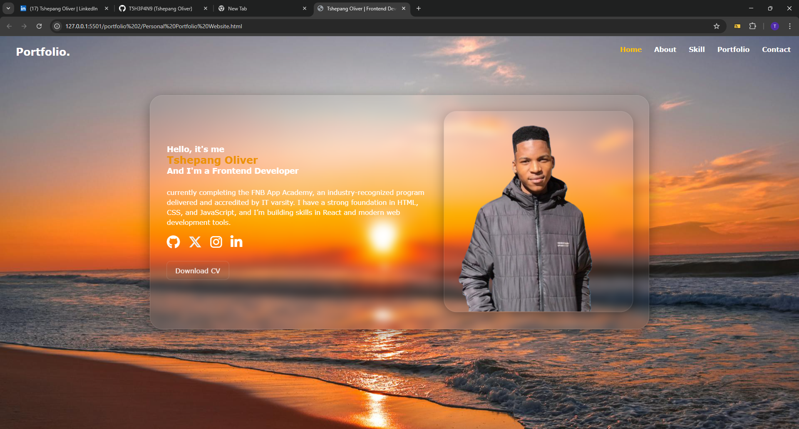
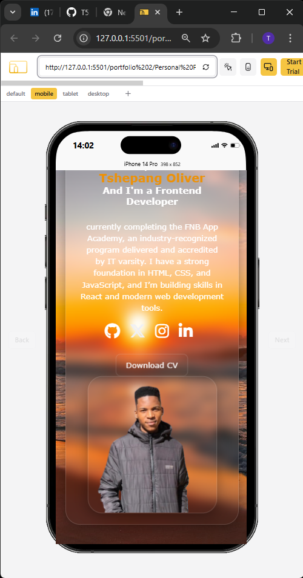
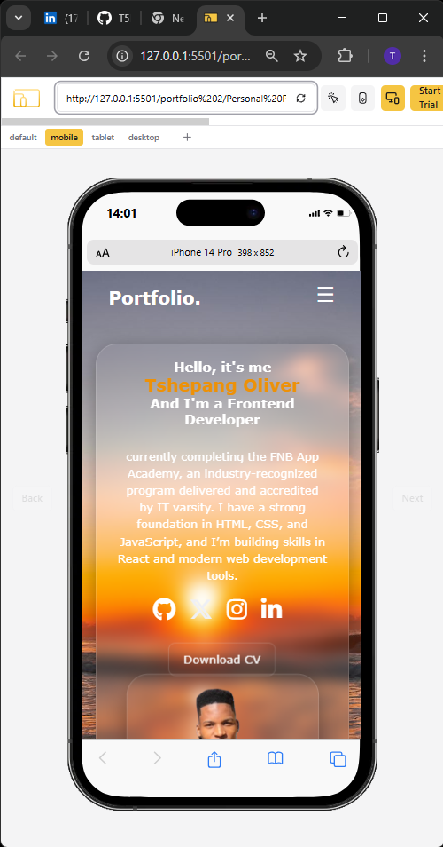
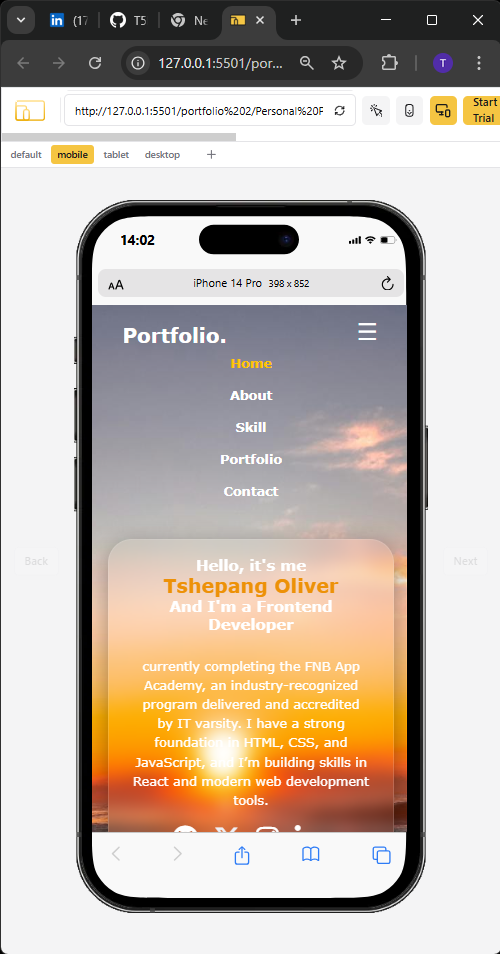

# Tshepang Oliver – Frontend Developer Portfolio

This is my personal developer portfolio, built using **HTML**, **CSS**, and **JavaScript**. It showcases who I am, what I’ve learned, and the projects I’m working on during my journey through the **FNB App Academy 2025**, powered by IT varsity.

## 🧑‍💻 About Me

Hi! I’m **Tshepang Oliver**, a frontend developer in training with a passion for clean, responsive design. I’m currently completing the FNB App Academy, where I’m gaining hands-on experience in:

- HTML5
- CSS3 (Flexbox, Grid, Animations)
- JavaScript
- Git & GitHub
- Modern Web Development Practices

## 🎯 Project Features

- ✅ Responsive Navigation Bar
- ✅ Mobile-friendly layout (iPhone 14 Pro tested)
- ✅ Animated buttons and blur effects
- ✅ Social media links and downloadable CV
- ✅ Clean layout and semantic structure

## 🛠️ Technologies Used

- HTML5
- CSS3
- JavaScript (for menu toggle)
- Font Awesome (for icons)

## 📸 Preview

  
  
  
  

## 📂 Folder Structure

## 📇 Author

**Tshepang Oliver**  
Frontend Developer | FNB App Academy 2025  | IT Varsity
- 🔗 [GitHub](https://github.com/T5H3P4N9)  
- 🔗 [LinkedIn](https://www.linkedin.com/in/tshepang-oliver-3a5540205/)  
- 📧 [Email](mailto:olivertshepang@gmail.com)

---

### 🚀 Deployment

You can deploy this site easily using:

- [GitHub Pages](https://pages.github.com/)
- [Netlify](https://netlify.com/)
- [Vercel](https://vercel.com/)

---

Would you like me to help you:
- Generate the preview image/banner?
- Host the site live on GitHub Pages?
- Polish your LinkedIn post once it's ready?

Let’s launch your portfolio the right way.

